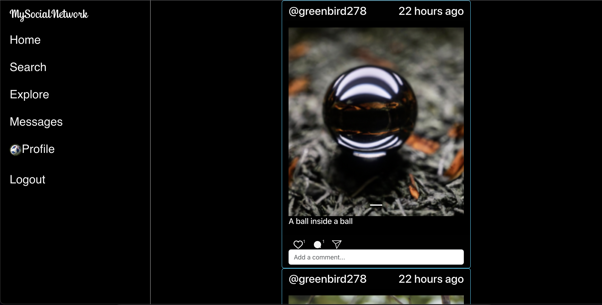

# my-social-network (Instagram-Clone)
An Instagram-like social media project, developed using React and Django.

Demo: [**mysocialnetwork.dev**](https://mysocialnetwork.dev)

## Features

- User registration and login.
- Home feed with recent content from followings.
- Interactive profile pages.
- Search for users.
- Follow and unfollow users.
- Explore content from all users.
- Upload and share posts/images.
- Like and Comment posts.

## Todo

- [] Messages between users
- [] Share posts function
- [] Notifications
- [] Respond to a comment
- [] Like a comment
